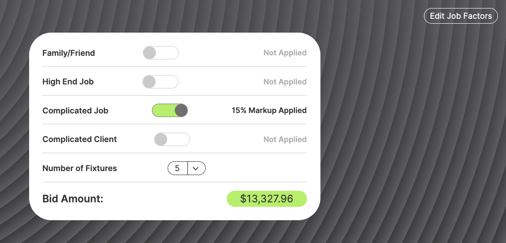
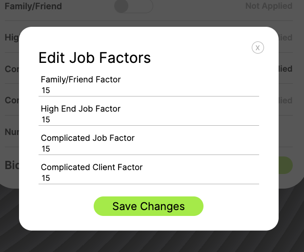
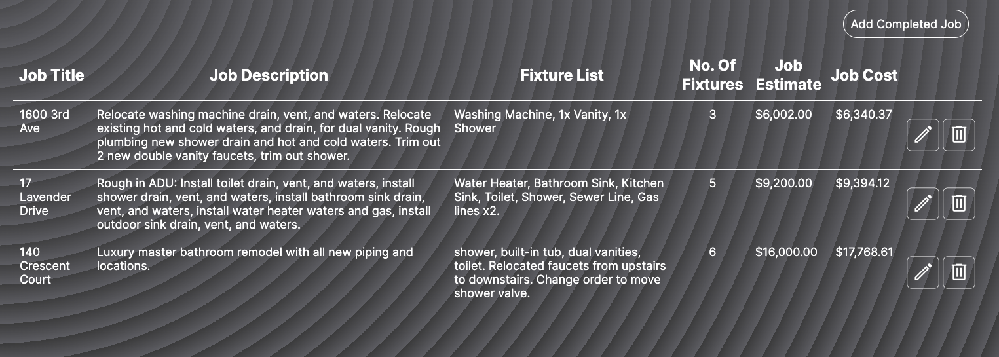
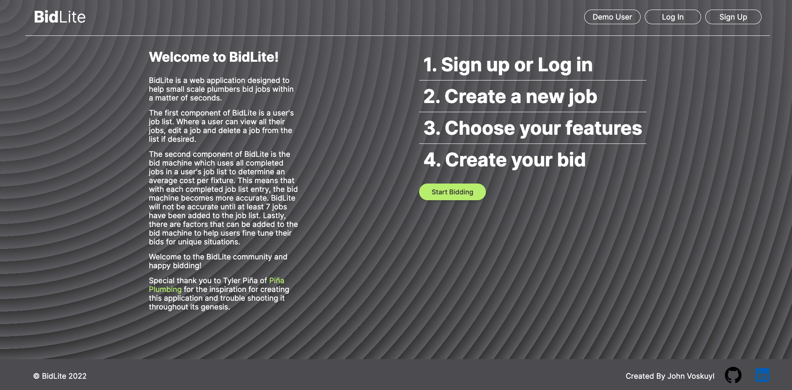
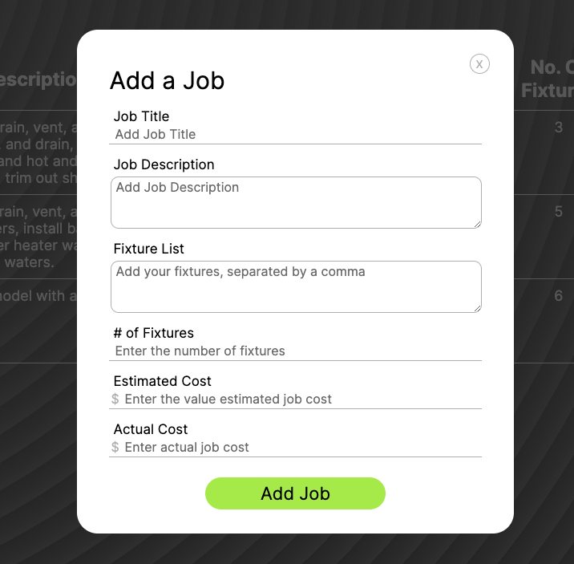

# Welcome to the BidLite README!

BidLite is a web application built to help small scale plumbing companies bid jobs within a matter of seconds. It consists of two main components, the bid machine and user's job list. User's additionally have the ability to add/edit job factors for unique job scenarios.

BidLite was built using PostgreSQL, Node.js, React.js, Express.js, Javascript, CSS and Redux.

The live application can be viewed and tested here: https://bidlite.onrender.com

## BidLite's Creation Story

The genesis of BidLite came from the need for small scale plumbing companies to speed up bid time. As a small scale plumber, more time spent bidding jobs means more time not working at your hourly rate. At the same time, an accurate bid is extremely important because a low bid means there may be no profits on the job and a high bid may mean that the company is not awarded the job.

This is where BidLite may come in handy.

## The Bid Machine

The bid machine gets an average install cost per fixture using all the data entered into the user's job list. This value allows the bid machine to work very quickly with one piece of information, the number of fixtures on the job. As new jobs are entered in the user's job list, the bid machine gets more accurate. It is important to note that the bid machine needs at least 7 jobs to start becoming accurate. Jobs bid before 7 completed jobs have been entered in the user's job list, will not be accurate.

### Job Factors (Built into the Bid Machine)

Not all jobs and clients are simple and straight forward. The bid machine has an extra feature to account for this. There are four factors that can be quickly turned on/off and updated to account for unique jobs scenarios and help the user produce an accurate bid.

## The Job List

The user's job list is a place where the user can add new jobs with a title, description, list of fixtures, number of fixtures, job estimate and final job cost. The user can use these columns to help keep track of specifics for each job. Each job is conveniently equipped with an update and delete button allowing the user to fine tunes their list of jobs as they see fit.

## Splash Page

## Add Job Modal

# Running This App Locally
